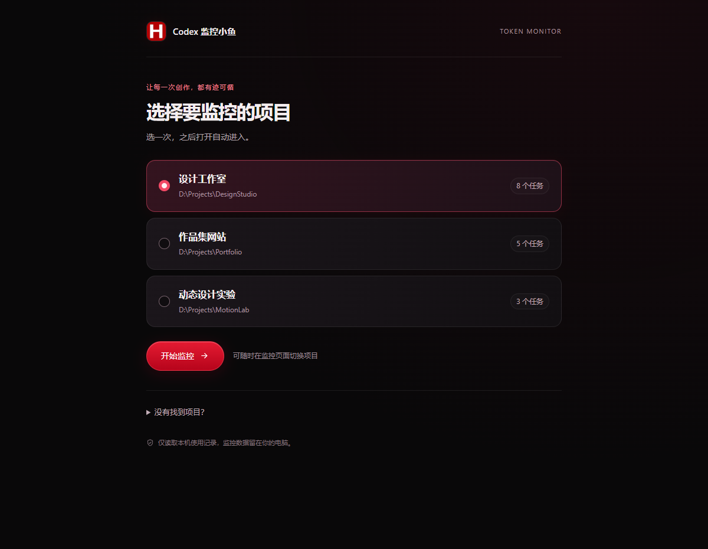
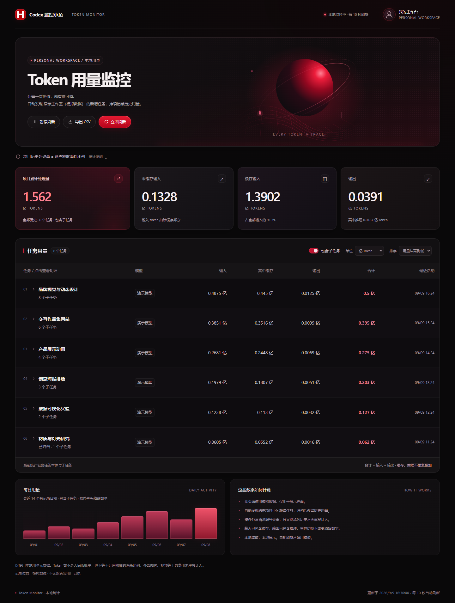

<div align="center">
  
  <h1>Codex 监控小鱼</h1>
  <p>给每一次创作，留下一份看得见的 Token 记录。</p>
  <p>给 Codex 一句话，选个项目，就能查看 Token 用量。</p>
</div>

Codex 监控小鱼读取本机 Codex 项目记录，按任务及子任务统计 Token。Windows 版支持由 Codex 自动安装并打开网页，不需要自己安装 Python 或配置 Skill。

本项目是独立社区工具，并非 OpenAI 官方产品。

## 推荐：给 Codex 一句话

在电脑上的 Codex 中发送：

```text
请按照 https://github.com/huangxin-design/codex-monitor-fish 的 INSTALL.md，自动安装 Codex 监控小鱼并打开项目选择网页，我选好项目后就开始监控 Token。
```

Codex 会自动下载、校验、安装并打开网页。你只需 **选择项目 → 开始监控**；以后会记住你的选择，再说“打开 Codex 监控小鱼”即可。自动安装目前支持 Windows 10/11 64 位，需要本机有 Codex 使用记录。

部署细节见 [INSTALL.md](INSTALL.md)。下面也保留直接下载的方式。

## 不通过 Codex：下载后双击

### [下载免安装启动版 →](https://github.com/huangxin-design/codex-monitor-fish/releases/latest/download/CodexMonitorFish-Windows.exe)

1. 下载 `CodexMonitorFish-Windows.exe`，双击打开。
2. 网页自动弹出，选择一个项目，点 **开始监控**。
3. 下次双击直接进入看板；网页中可 **切换项目** 或 **退出监控**。

适用于 Windows 10/11 64 位，需要这台电脑上有 Codex 使用记录。程序自带运行环境，无需管理员权限。当前版本未做代码签名，Windows 可能显示发布者无法验证的提示。





> 截图使用模拟数据，不含真实用户的任务、路径或用量。

## 功能

- **按项目统计**：任务本体与子任务分别显示，归档后保留历史用量。
- **可核对的数字**：区分输入、缓存、输出与推理，支持亿/完整整数，CSV 导出保留整数。
- **持续更新**：默认每 10 秒刷新；支持暂停、立即刷新、排序与展开任务详情。
- **历史记录较多也能等待**：Windows 启动版在后台读取，页面显示加载状态；等待期间可以切换项目，不会显示成 0 或误报连接中断。
- **H 品牌标识与个人头像**：左侧固定 H 标识；右侧点击更换自己的头像。
- **桌面与窄屏**：大屏表格，窄屏任务卡片，合计始终可见。
- **本地运行**：Python 标准库，无 API Key、无第三方运行依赖，监听 `127.0.0.1`。

<details>
<summary>进阶方式：安装 Skill（macOS / Linux 或需要由 Codex 配置时）</summary>

## 安装 Skill

需要本机 Codex 使用记录及 **Python 3.10+**。这不是上传到普通网页聊天就能读取电脑记录的云端工具。

1. 下载本仓库源码，或使用打包得到的 `codex-token-monitor-skill.zip`。
2. 将完整的 `skills/codex-token-monitor` 文件夹（独立 Skill 压缩包中直接为 `codex-token-monitor`）放入个人 `.agents/skills/` 目录：

   | 系统 | 安装位置 |
   | --- | --- |
   | Windows | `%USERPROFILE%\.agents\skills\codex-token-monitor` |
   | macOS / Linux | `~/.agents/skills/codex-token-monitor` |

   也可安装到目标项目的 `.agents/skills/`，仅对该项目使用。目录及自动发现方式参见 [OpenAI 官方文档](https://learn.chatgpt.com/docs/build-skills)。如果没有出现，重启 Codex。
3. 在 Codex 中打开想统计的项目，发送：

   ```text
   使用 $codex-token-monitor，帮我为当前项目生成 Codex 监控小鱼，并打开页面。
   ```

Codex 会配置项目范围与本机数据位置、校验记录，并打开本地页面。不要在 Skill 的模板目录里直接运行服务；首次生成的监控目录才是日常使用的应用。

更多说明见 [朋友使用指南](docs/使用说明.md)。

</details>

<details>
<summary>开发者方式：Python 启动与配置参数</summary>

## 不通过 Skill 运行

在仓库根目录执行；将示例路径替换为自己的实际项目，输出目录应为新目录或空目录。Windows 可把 `python` 换成 `py -3`，macOS/Linux 可换成 `python3`。

```text
python skills/codex-token-monitor/scripts/setup_monitor.py --project "/path/to/project" --output "/path/to/project/codex-monitor-fish"
python "/path/to/project/codex-monitor-fish/monitor.py" --snapshot
python "/path/to/project/codex-monitor-fish/launch.py"
```

Windows 示例：

```powershell
py -3 .\skills\codex-token-monitor\scripts\setup_monitor.py --project "D:\My Projects\Demo" --output "D:\My Projects\Demo\codex-monitor-fish"
py -3 "D:\My Projects\Demo\codex-monitor-fish\launch.py"
```

之后 Windows 可双击生成目录中的 `打开监控器.cmd`。输出目录非空时，初始化会拒绝覆盖；已有应用直接启动即可。

| 选项 | 用途 |
| --- | --- |
| `setup_monitor.py --codex-home 路径` | 指定迁移后的 Codex 数据目录；默认取 `CODEX_HOME` 或 `~/.codex` |
| `--name 名称` | 设置页面显示的项目名称 |
| `--port 18767` | 配置其他本地端口 |
| `--avatar 图片路径` | 设置右侧默认头像，支持 JPG、PNG、WebP |
| `--exclude-task 任务编号` | 排除该任务及其所有子任务，可重复指定 |
| `launch.py --no-browser` | 只启动并输出地址，供应用内浏览器打开 |
| `launch.py --port 18767` | 临时使用其他端口，不修改配置文件 |

右侧头像还可直接点击上传，最大 2 MB，保存在当前浏览器；换浏览器或端口后需重新选择。左侧品牌图保持不变。

</details>

## 统计口径与兼容性

**这是本机日志可见的历史 Token 处理量，不是订阅剩余额度，也不是计费账单。** 缓存输入已包含在输入中，推理输出已包含在输出中，不能再次相加。图片、视频等外部工具费用不在统计范围。

当前解析器要求 `state_5.sqlite` 中的任务与父子关系，以及日志中的逐次 `token_usage_record`。它按任务和请求编号去重，避免分叉历史和重复记录被重复计算。具体约定见 [统计说明](skills/codex-token-monitor/references/accounting.md)。

- 只匹配配置项目目录的根任务；子任务通过父子关系归并。其他项目、独立 worktree、其他设备与云端记录不会自动并入。
- 旧版累计 `token_count` 不能代替完整的逐次请求记录。不兼容结构会报错；缺失或部分记录会提示结果不完整。
- 新请求写入日志后才会显示。日期按服务电脑的本地时区。
- 自动刷新本身不会调用模型；调用 Codex 创建、维护这个 Skill 会正常产生任务用量。

Windows 已进行真实启动、浏览器和头像交互验证。macOS/Linux 路径逻辑通过合成数据测试，尚未进行实机浏览器验证；仓库提供三平台 CI 以便发布后持续检查。

## 数据与隐私

服务只读任务索引和会话日志，不读取登录密钥、不上传数据、不修改 Codex 数据。网页没有远程脚本、字体或图片依赖；官方说明链接仅在点击时打开。

生成的配置、快照、CSV、日志、截图可能包含使用者的任务名称和本机路径，请勿提交到公共仓库。仓库的忽略规则与发布脚本会排除运行产物；用于展示的截图均为模拟数据。头像选择保存在浏览器本地。

Windows 启动版把项目选择保存在 `%LOCALAPPDATA%\CodexMonitorFish`；它不会安装 Skill、添加开机启动项或改写 Codex 的原始记录。退出后不再后台读取数据。

SQLite 在读取正在使用的数据库时可能创建共享内存辅助文件（`-shm`）；程序不执行数据库写入语句，也不改动会话日志。安全检查与已知限制见 [对抗性审核记录](docs/安全审核.md)。

## 开发与发布

运行后端及初始化测试：

```text
python -m unittest discover -s skills/codex-token-monitor/assets/app -p "test_*.py"
python -m unittest discover -s tests -p "test_*.py"
python -m unittest discover -s desktop -p "test_runtime.py"
```

Windows 安装器的离线对抗测试：`powershell.exe -NoProfile -File tests/test_installer.ps1`。也可用 PowerShell 7 运行同一文件。

构建独立 Skill 包：

```text
python tooling/build_release.py
```

输出位于 `dist/`，包含 Skill ZIP 与 SHA-256 校验文件。GitHub Actions 会在提交和拉取请求时运行测试并验证打包；实际 CI 结果以仓库运行记录为准。

在 Windows 构建免安装 EXE（仅开发者需要打包工具）：

```text
python -m pip install -r tooling/requirements-build.txt
python tooling/build_windows.py
python desktop/test_executable.py --exe dist/CodexMonitorFish-Windows.exe
```

EXE 内含 Python 与 PyInstaller 引导程序的许可证声明。免安装启动版仅提供 Windows 64 位；其他平台目前使用 Skill 或源码方式。

提交问题或贡献前，请阅读 [贡献说明](CONTRIBUTING.md) 和 [问题报告说明](SECURITY.md)。

## 许可与品牌

开源许可证尚待作者选择，当前 [LICENSE](LICENSE) 未授予开源许可。已取得的明确分享许可继续有效。H 标识和项目名称单独见 [品牌说明](BRANDING.md)。
